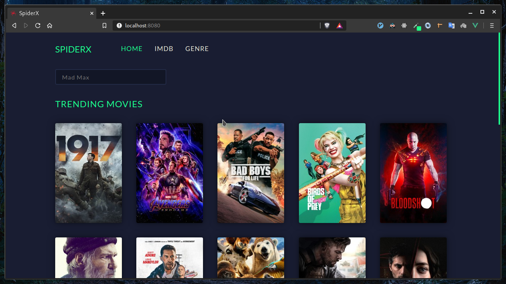
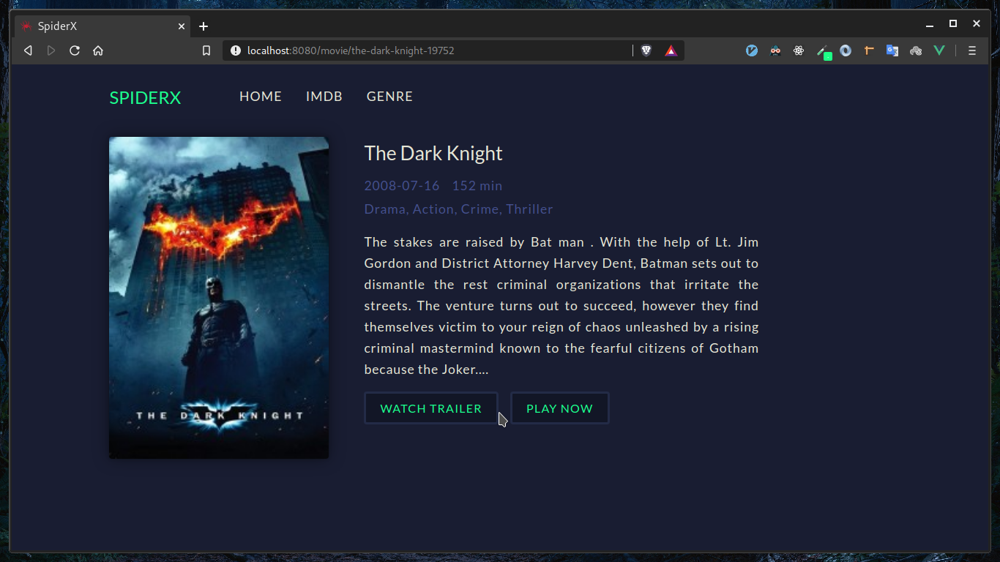
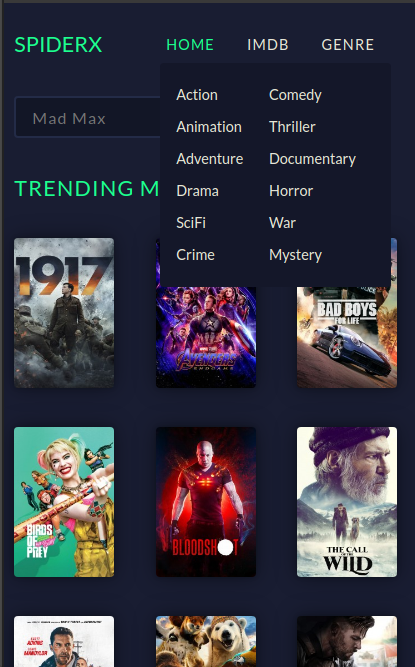

# SpiderX
SpiderX allows you to watch movies by scraping data from the internet. The frontend is built with Vue.js and the scraping process in handled by python scrapy framework.

## How it works
1. The user searches will be first sent to firestore, if the search is not found in the firestore then the scraper (using python scrapy framework) will be called to initiate the scraping process.
2. Once the scraper scrapes the data, the data scraped will be sent to firestore.
3. Using firestore real-time updates, the vue interface will be updated in real-time.

## UI

# Mobile Layout

